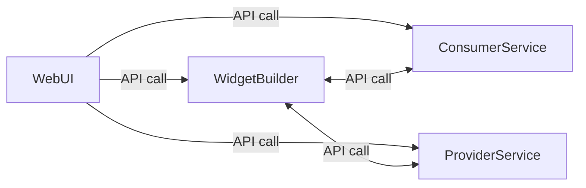
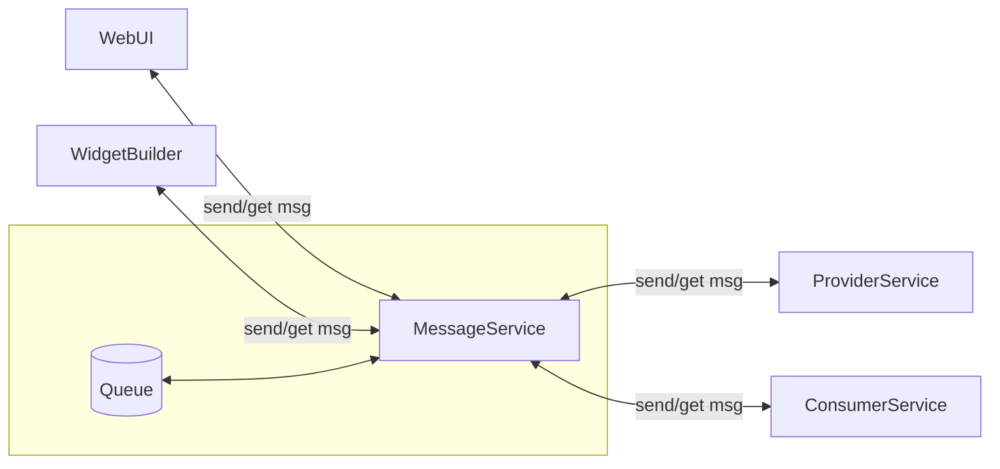
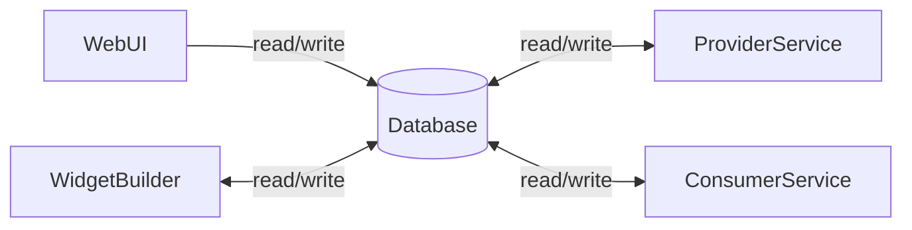

## Architecture Tradeoffs

Compare and contrast the following 3 architectures. What are there strengths and weaknesses? When would you use one over another?

## API Call Architecture

- WebUI accepts widget request from user
- WebUI calls ProviderService to assign a provider for a widget request
- WebUI call WidgetBuilder to process a widget request
- WidgetBuilder calls ProviderService to get provider data
- ...

## Message Queuing Architecture

- WebUI accepts widget request from user
- WebUI sends a message to ProviderService to assign a provider for a widget request
- ProviderService gets message and sends a message to WebUI with assigned provider data
- ...

## Reconciliation Architecture

- WebUI accepts widget request from user
- WebUI creates a widget request in the Database
- ProviderService queries for widget requests that have no Provider assigned
- ProviderService updates widget requests with Provider data
- WidgetBuilder queries for widget requests that have a Provider, a Consumer, but no Builder
- ...