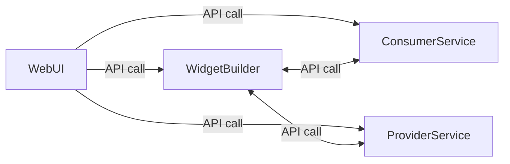
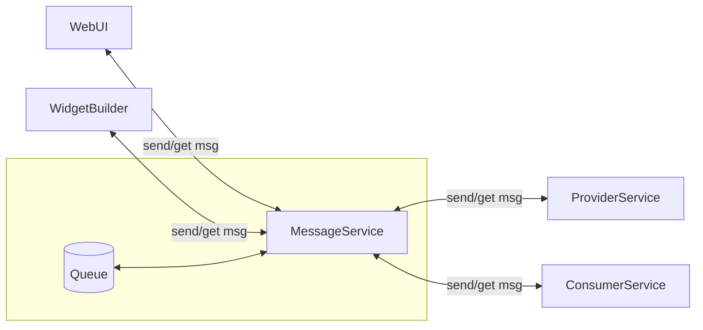
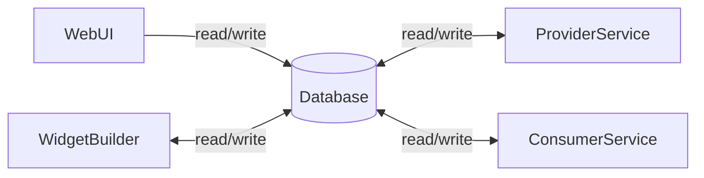

## Architectures

## Direct API Call

```mermaid
flowchart LR
    WebUI --API call--> ConsumerService
    WebUI --API call--> ProviderService
    WidgetBuilder <--API call--> ConsumerService
    WidgetBuilder <--API call--> ProviderService
    WebUI --API call--> WidgetBuilder
```

## Message Queuing

```mermaid
flowchart LR
    WebUI <--send/get msg--> MessageService
    WidgetBuilder <--send/get msg--> MessageService
    subgraph " "
    db[(Queue)] <--> MessageService
    end
    MessageService <--send/get msg--> ProviderService
    MessageService <--send/get msg--> ConsumerService
```

## Reconcilation

```mermaid
flowchart LR
    WebUI --read/write--> id1[(Database)]
    id1[(Database)] <--read/write--> ProviderService
    id1[(Database)] <--read/write--> ConsumerService
    WidgetBuilder <--read/write--> id1[(Database)]
```