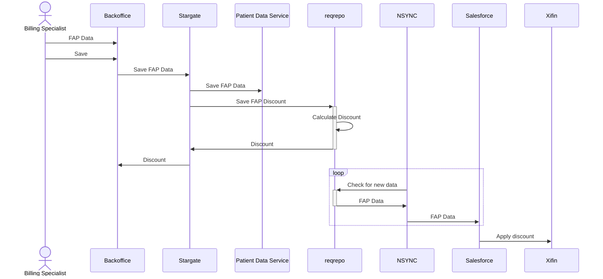

<!-- Space: EP -->
<!-- Parent: Teams -->
<!-- Parent: Internal Apps -->
<!-- Title: TDD Financial Assistance Program -->

| Document        |               |
| --------------- | ------------- |
| Status          | Draft         |
| Authors         | JD Brennan    |
| Reviewers       | Reuben Jacobs |
|                 | Nathan Louie  |
|                 | Debra Liu     |
| Version         | 2024-11-18.01 |
| PRD | [CX Product Functional Specification](https://docs.google.com/document/d/1cFaHknXTRDvAHja3wmrAf4sQuGMPjSwZUTfbtUAhXiQ)

## Table of Contents

<!-- Include: ac:toc -->

## Summary

Provide a mechansim in Backoffice for the Billing Team to calculate financial assistance discounts. This replaces an existing system using Excel and Access.

## Use Cases

1) Add FAP discount to existing order
2) New order created for patient that has already been approved for FAP discount
3) New order created for patient that has expired FAP discount
--- V1 ---
4) Attach files to patient user, documenting FAP eligibility

## Component Changes

### Patient Data Service (PDS)

Add new model FinancialAssistance

| field | type | notes |
| -- | -- | -- |
| patient_id | fk |
| annual_household_income | int
| number_of_household_members | int
| has_loss_of_income | bool
| lost_income_per_month | int
| lost_income_time_frame | int | number of months? |
| has_treatment_expenses | bool
| medical_expenses | int
| care_expenses | int
| travel_expenses | int
| fap_discount | int
| fap_expiration | date

And new API associate API calls

| Task | Component | API call |
| -- | -- | -- |
| Create Patient FA Record | PDS | POST /v1/patient-financial-assistance
| Get Patient FA Record | PDS | GET /v1/patient-financial-assistance/{id}
| Update Patient FA Record | PDS | PATCH /v1/patient-financial-assistance/{id}

### Reqrepo

Add new model FinancialAssistance

| field | type |
| -- | -- |
| patient_id | fk |
| fap_discount | int
| fap_expiration | date
| date_modified | date

And associated API calls

| Task | Component | API Call |
| -- | -- | -- |
| Upsert Patient FA Record | reqrepo | PUT /v4/patient-financial-assistance/{id}
| Get Patient FA Record | reqrepo | GET /v4/patient-financial-assistance/{id}
| List Patient FA Records | reqrepo | GET /v4/patient-financial-assistance

### SFDC Gateway (NSYNC)

Add new business logic

* check for new Patient FA data when polling reqrepo
* send any new Patient FA data to Salesforce

Data to send SFDC:

Send along with existing patient data object:

1. is_eligible_for_discount (bool)
2. last_mod_date (date)
3. discount_percentage (int)
4. fpl_range (string)
4. good_until_date (date)

### Backoffice

Add new UI components

* On the Patients tab, add a new subtab for Financial Assitance
  * See [Click Through](https://docs.google.com/presentation/d/1dz97MDfi6gQrWMh-g4esb-d04MRQmEQ5znwgEkCNELU/edit#slide=id.g313cabc62a5_0_2) for mockup
  * Allow Billing Team (and only Billing Team) to view, edit and update

## Sequence Diagrams

Overview of component interactions:

