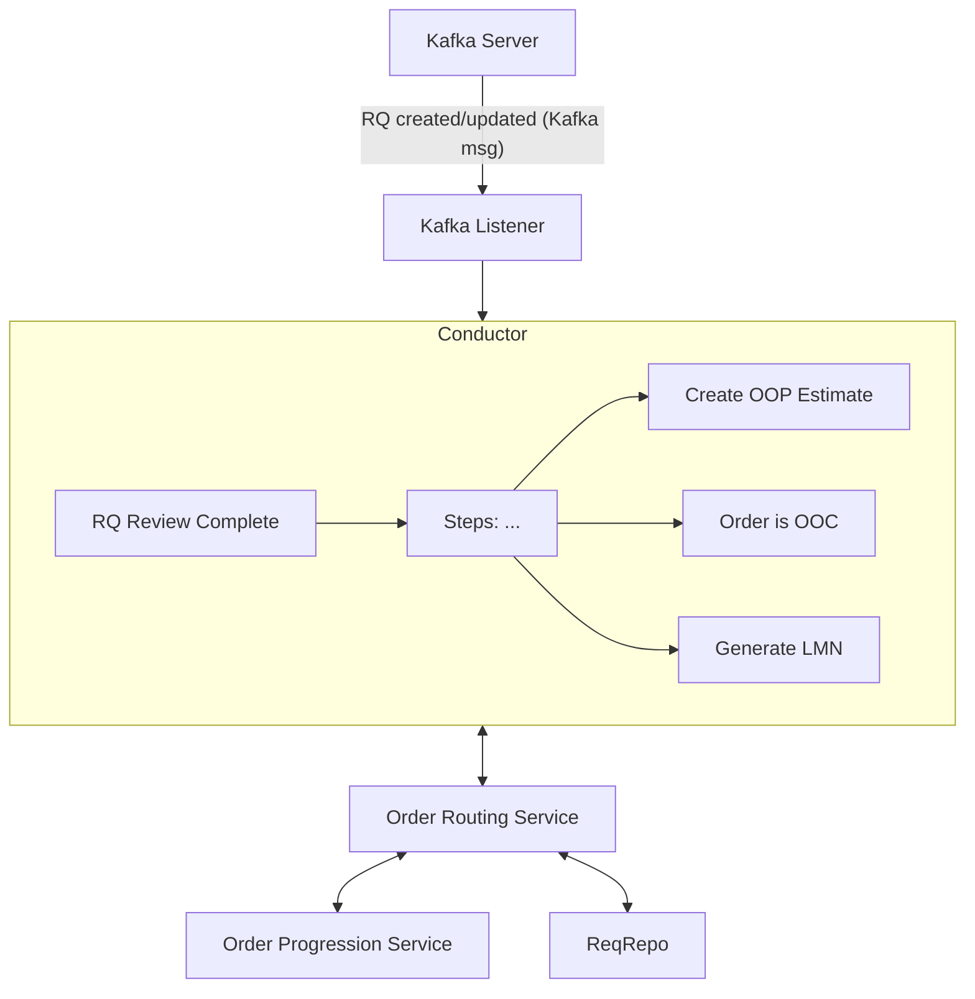
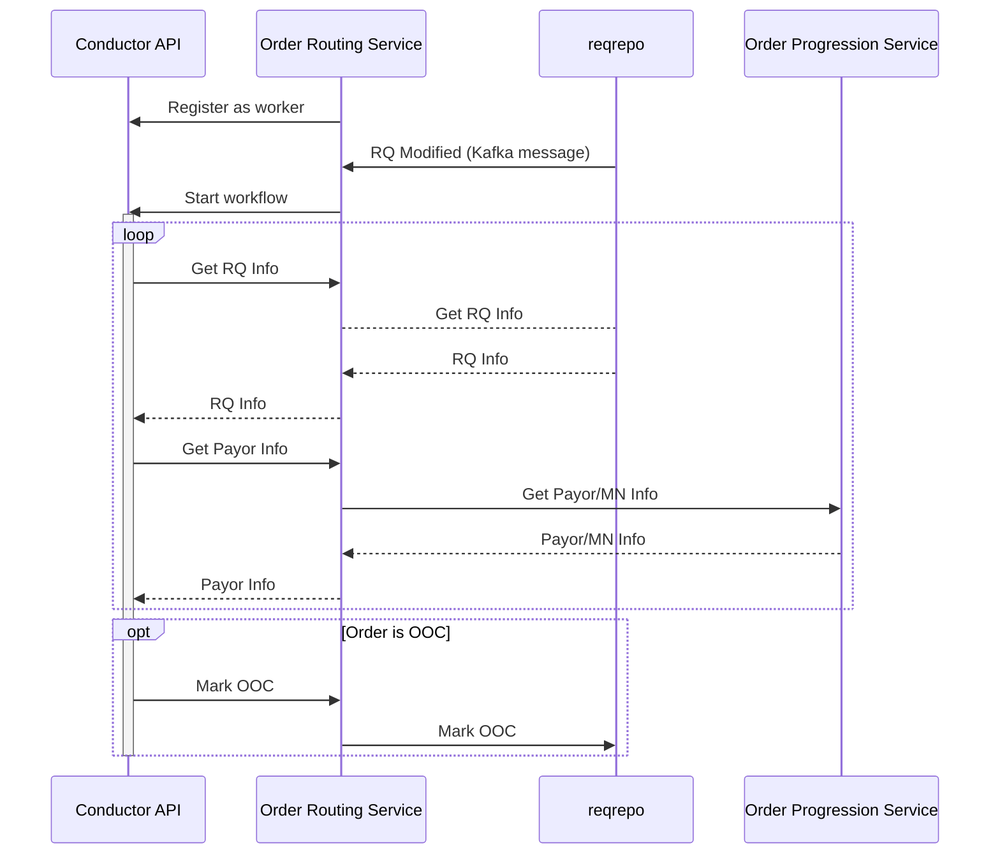

<!-- Space: ~6357f924b7b39379d71f6b22 -->
<!-- Title: JD's Playground -->

This is a paragraph.

## What good is sitting alone in your room?

| Document        |               |
| --------------- | ------------- |
| Status          | Draft         |
| Authors         | JD Brennan    |
| Reviewers       | Reuben Jacobs |
|                 | Nathan Louie  |

## Overview

    participant RR as reqrepo
    participant ORS as "Order Routing Service"
    participant CAPI as "Conductor API"
    participant OPS as "Order Progression Service"
    RR->>ORS: RQ Modified Kafka Message

Sequence Diagram

> I wonder how Confu handles block quotes This could be ugly.

1. First things first
2. Second changes are rare
3. Third time's the charm

Hmmm. <ac:inline-comment-marker ac:ref="21eaddf5-d89b-4450-9eda-7486be4e42a7">Another paragraph</ac:inline-comment-marker>.

Bullet list

 - Earth
 - Wind
 - Fire

And some `code`

---

[And try this link](https://example.com)

Thanks for playing!

## More stuff

And what do I have to say here?

