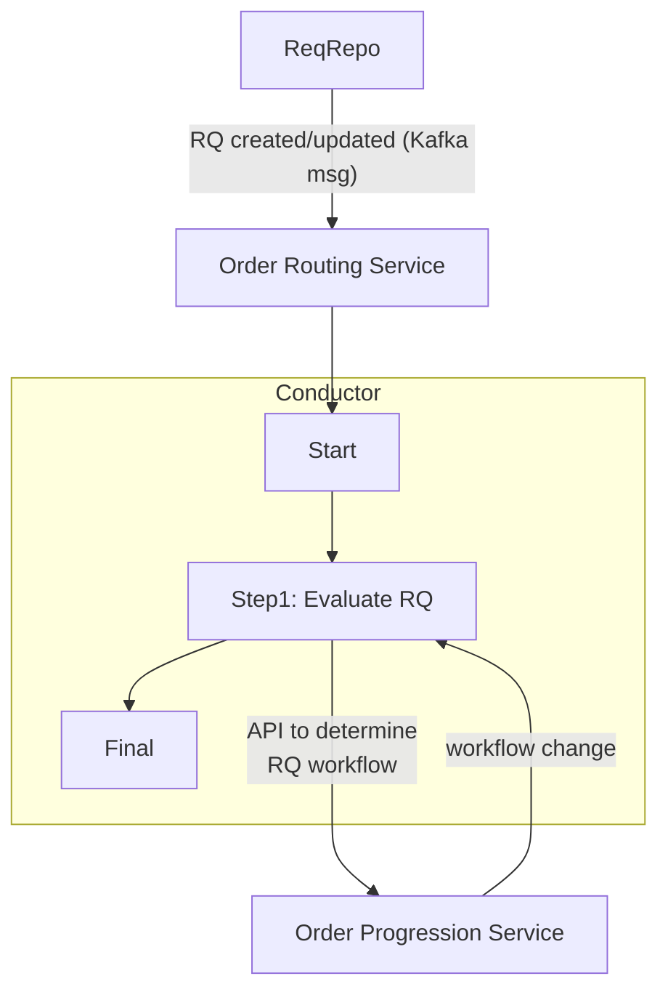

<!-- Space: ~6357f924b7b39379d71f6b22 -->
<!-- Title: JD's Playground -->

This is a paragraph.

## What good is sitting alone in your room?

| Document Status | Draft         |
| --------------- | ------------- |
| Authors         | JD Brennan    |
| Reviewers       | Reuben Jacobs |
|                 | Nathan Louie  |

## Overview

> I wonder how Confu handles block quotes This could be ugly.

1. First things first
2. Second changes are rare
3. Third time's the charm

Hmmm. Another pargraph.

Bullet list

 - Earth
 - Wind
 - Fire

And some `code`

---

[And try this link](https://example.com)

Thanks for playing!
