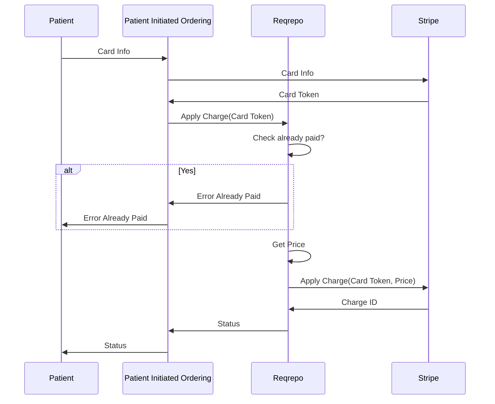
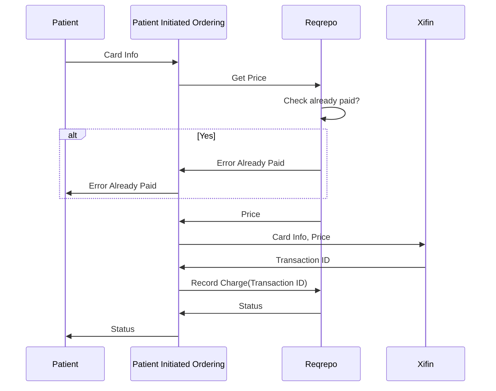
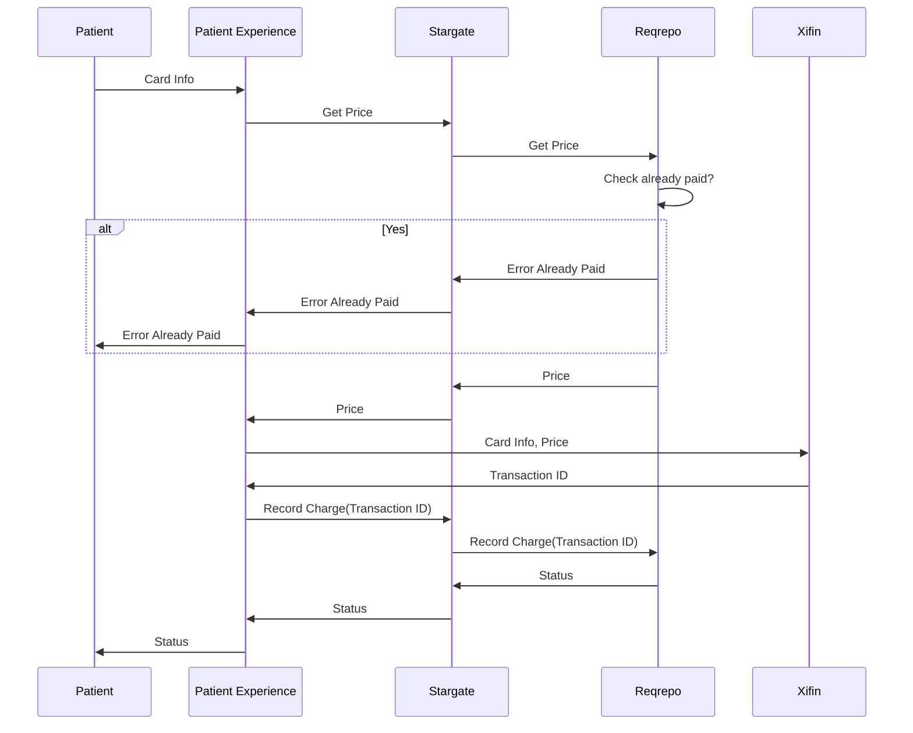
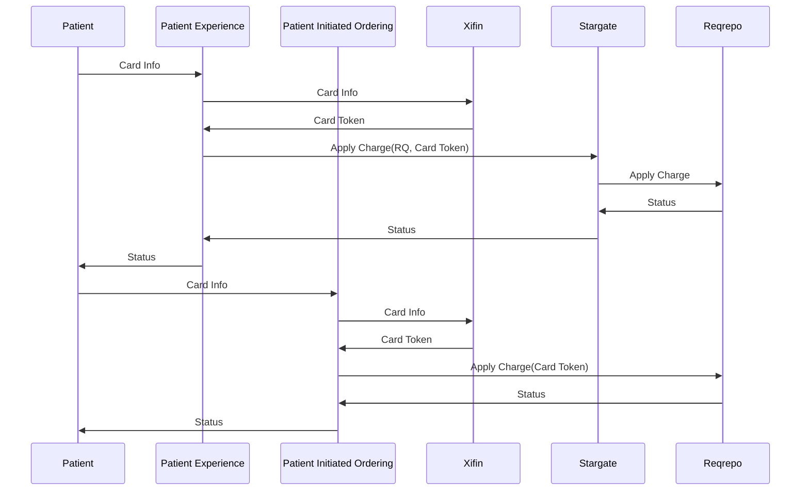

<!-- Space: EP -->
<!-- Parent: Teams -->
<!-- Parent: Internal Apps Teams -->
<!-- Title: TDD Stripe Replacement -->

| Document        | Technical Design Document |
| --------------- | ------------------------- |
| Status          | Draft                     |
| Authors         | JD Brennan               |
| Reviewers       | Reuben Jacobs            |
|                 | Nathan Louie             |
|                 | Amy Catalino             |
| Version         | 2025-08-27.01            |
| PRD | [CX Product Functional Specification: Xifin Credit Card Processing](https://labcorp-my.sharepoint.com/:w:/p/nathan_louie/Ed6PLV-uSi1MtnMRmsbPS4UBePYJLj0Mu5thnu_uhHGrew?e=AgPYCg)

## Table of Contents

<!-- Include: ac:toc -->

## 1. Summary
This document details the technical approach for replacing the current Stripe-based payment flow with an embedded Xifin payment flow. The change impacts Patient Experience, Patient Initiated Ordering, Stargate and Reqrepo. Labcorp uses Xifin for patient payment services, so we want to standardize on that and not continue to pay for Stripe services.

## 2. User Scenarios

### 1. Patient Pay

#### Known Patient

1. Go to: https://invitae.stg.locusdev.net/
2. Click on Sign In button (or My account button if already logged in)
3. Enter username & password, click Sign in button (if not already logged in)
4. Click Pay for a test
5. Click Make Payment under Pay for your in-progress test
6. select a test
7. enter credit card number
8. click MAKE PAYMENT button

#### Guest Patient

1. Go to: https://invitae.stg.locusdev.net/us/patients/requisition-billing
2. Enter RQ & Patient date of birth
3. Click CONTINUE
4. Enter credit card number
5. Click COMPLETE PAYMENT

### 2. Patient payment plan 

1. Patient calls Customer Support

### 3. Partnerships bulk payment 

1. Billing Team member handles this with Xifin

## 3. Component Changes

### 3.1 Reqrepo
* Update PE API to accept `card_xifin_token` instead of `card_stripe_token`
* Update Charge model to store new `xifin_charge_id`

### 3.2 Stargate
* Update to use new Reqrepo PE API

### 3.3 Patient Experience
* Add reference to new toggle CX_USE_XIFIN_FOR_PATIENT_PAY
* Update PatientPayPaymentModalContainer to render new Xifin iframe instead of Strip if the toggle is set
* Update to use new Stargate PE API 

### 3.4 Patient Initiated Ordering
* Add reference to new toggle CX_USE_XIFIN_FOR_PATIENT_PAY
* Update PatientPay to render new Xifin iframe instead of Strip if the toggle is set
* Update to use new Reqrepo PE API 

User scenarios 2 and 3 do not require any code changes, as the changes will require the use of different 3rd party systems.

## 4. Sequence Diagrams

### 4.1 Existing Stripe Flow - Unknown Patient

### 4.2 Existing Stripe Flow - Known Patient

Same as above except Patient Experience doesn't talk to Reqrepo directly, but through Stargate.

### 4.3 New Xifin Flow - Unknown Patient

### 4.4 New Xifin Flow - Known Patient

Same as above except calls to Reqrepo go through Stargate

### 4.1 Old Flow

## 5. Open Issues

| Issue | Resolution | Status |
| ----- | ---------- | ------ |
| Should we update these API calls to pass a card_xifin_tokens? | *Probably* | Open |
| Should we update the Charge model in the RR DB to distinguish between Stripe payment and Xifin payment? | *Probably* | Open |
| Will changes to the Charge model does that affect downstream services like Salesforce? | | Investigating |
